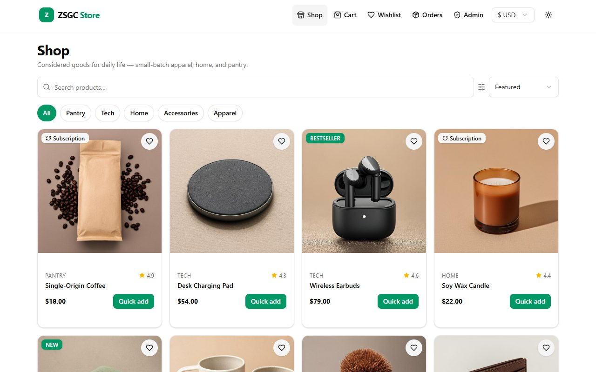
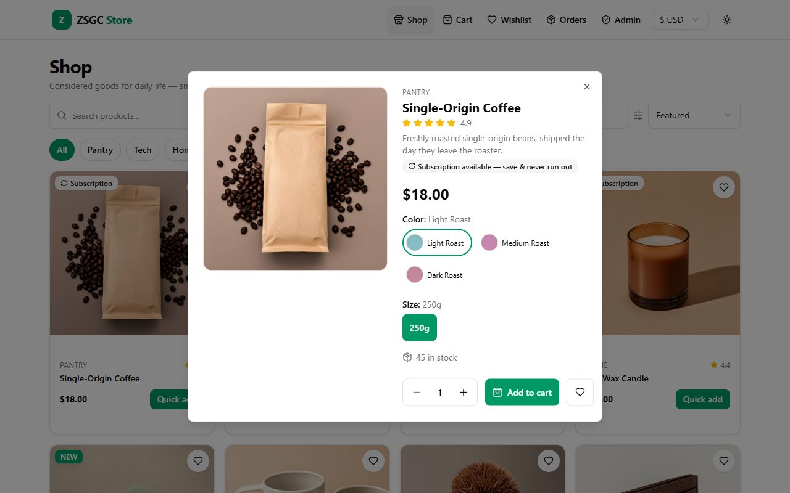
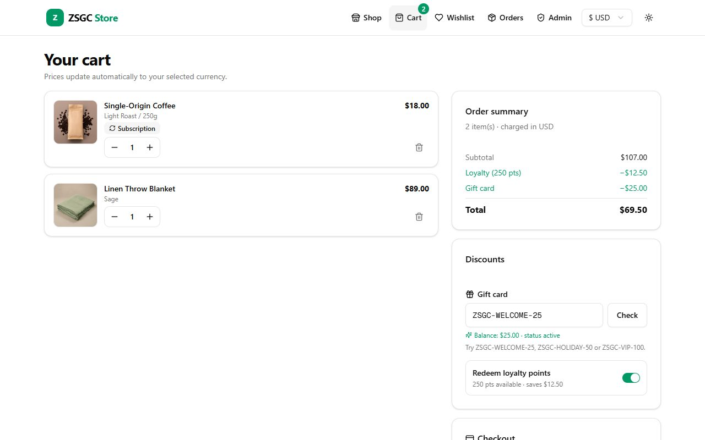
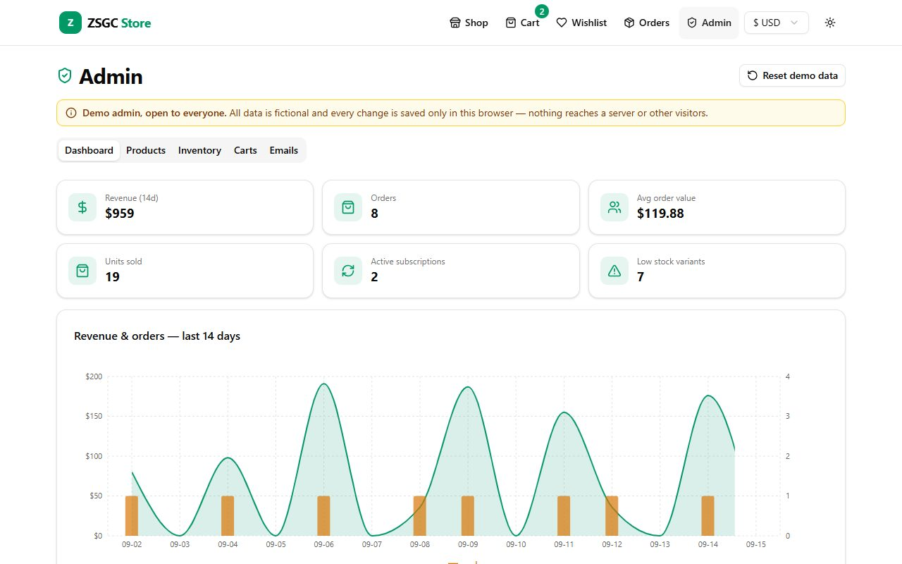
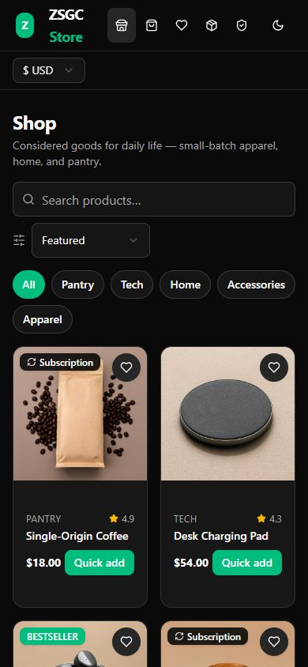

# ZSGC Store

A front-end e-commerce demo: storefront, cart and checkout with gift cards, loyalty points and subscriptions, plus an admin dashboard with sales analytics. It needs no backend, database, or accounts, and every visitor gets their own sandbox in the browser.

**Live demo → [zsgc-store.vercel.app](https://zsgc-store.vercel.app)**

> **中文簡介**：以 Next.js 16 打造的電商展示網站，包含商品瀏覽、購物車、禮物卡、會員點數、訂閱商品、多幣別顯示，以及具銷售圖表的管理後台。所有資料皆為虛構，並儲存在瀏覽器中，不需資料庫或登入，也不會真的付款。



| Product detail | Cart with gift card and points |
| --- | --- |
|  |  |

| Admin dashboard | Mobile, dark mode |
| --- | --- |
|  |  |

---

## Try it

| What | How |
| --- | --- |
| Shop | Browse, filter by category, search, sort by price or rating |
| Gift cards | At checkout, enter `ZSGC-WELCOME-25`, `ZSGC-HOLIDAY-50`, or `ZSGC-VIP-100` |
| Loyalty points | You start with 250 points; toggle "Redeem loyalty points" in the cart |
| Admin | Open **Admin**, edit products, send cart-recovery emails, export inventory, then **Reset demo data** |

No payment is processed and no email is sent. Orders and emails are simulated.

## Features

**Storefront**
- Product grid with category filters, search and sorting
- Product detail dialog with color/size variants, per-variant stock and pricing
- Wishlist with shareable links (`/?wishlist=…` imports items into the visitor's wishlist)
- Display prices in USD, EUR, GBP or TWD
- Light and dark mode, responsive down to phone widths

**Checkout**
- Loyalty points: 1 point = $0.05 off; earn 1 point per $1 spent
- Gift cards applied after loyalty discounts, with balance tracking
- Subscription products that renew monthly
- Stock is validated before anything changes, so a failed checkout never leaves a partial order

**Admin dashboard**
- KPIs, 14-day revenue/orders chart, revenue by category, top products
- Product editor with variant management and an active/inactive toggle
- Inventory view with low-stock highlighting and CSV export
- Abandoned-cart list with recovery emails, and a log of every email sent

## How the demo works

- The catalog, gift cards, sample orders and abandoned carts are fictional seed data in `src/lib/demo-data.ts`
- `src/lib/demo-db.ts` implements the store logic (cart, checkout, loyalty, gift cards, stats) in the browser and saves each visitor's state in `localStorage`
- The site builds to static pages and can be hosted anywhere, with no environment variables or server
- **Admin is a demo interface, not a secured area.** It has no login, and its changes only affect the current browser

## Tech stack

| Layer | Tools |
| --- | --- |
| Framework | Next.js 16 (App Router), React 19, TypeScript |
| UI | Tailwind CSS 4, shadcn/ui (Radix), Lucide icons, Recharts |
| State | TanStack Query, Zustand, `localStorage` |
| Hosting | Vercel |

## Run locally

Requires Node.js 20.9 or newer.

```bash
npm install
```

```bash
npm run dev
```

Then open http://localhost:3000.

| Command | Does |
| --- | --- |
| `npm run dev` | Start the dev server on port 3000 |
| `npm run build` | Production build |
| `npm run start` | Serve the production build |
| `npm run lint` | Run ESLint |

## Project structure

```
src/
  app/page.tsx           Single-page storefront shell
  components/store/      Storefront and admin UI
  hooks/use-store.ts     Query hooks for products, cart, wishlist, orders, loyalty
  lib/
    demo-data.ts         Fictional seed data
    demo-db.ts           In-browser store logic and persistence
    currency.ts          Currency conversion and formatting
public/products/         Product images
docs/screenshots/        README images
```

## Demo limitations

- Data lives in each visitor's browser: it isn't shared between devices, and clearing site data resets it
- Prices in other currencies use fixed sample exchange rates
- Checkout, payments, subscriptions and emails are simulated
